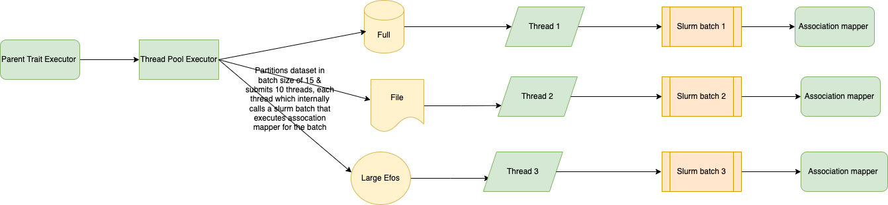

# gwas-association-parent-trait-executor
This is a component which has been created in order to prepopulate parent traits for associations & studies in DB . This is done in order to
optimise Rest API v2 search for EFO terms with child traits. 

This component is a slurm job wrapper component which executes the parent trait mapper in cluster. The component entry point is shell script
which executes a spring boot batch job , The job triggers a thread pool executor which submits a thread for partitioned EFO dataset with configurable partition
size (15) & the thread submits a slurm job with EFO shortforms as parameter . The slurm job executes the parent mapper job in cluster & returns 
the job status to the thread pool executor , this process is repeated till the dataset is exhausted.

The Job runs in 3 modes -:

-  **full** -> In this mode the job runs for all EFO's present in DB, except EFO Ids with large number of children which are executed separately

-  **file** -> In this mode the job based file based input for specific EFO's to be used in case of some errors.
 
- **largeefos** -> In this mode the job runs for selected EFO id with large number of children , this runs recursive slurm batches for the child efos due to
intensive processing required for EFO's with large number of children

## Requirements

Before you begin, ensure you have met the following requirements:

- You have a MacOSX/Linux/Windows machine.
- You have Java 8 installed.

## Deploying this service locally
1. Install Java and JDK8
2. Clone the application from https://github.com/EBISPOT/gwas-data-services.git
3. Open the module gwas-association-parent-trait-executor.
3. Run `mvn clean install` to build the application and generate executable jar

## Running locally

1. This is a wrapper component to run in cluster & can't be executed locally.

## Running from Cluster

1. Login to codon-slurm-login
2. Run  sbatch `/hps/software/users/parkinso/spot/gwas/prod/sw/parent-trait-mapper-executor <mode> <partition_size>`
3. Mode Options -> [full,file,largeefos] 
4. Partition Size Options -> [15]
4. Check the logs at following path `/hps/nobackup/parkinso/spot/gwas/logs/parent-trait-mapper-executor/logs/bsub`
5. Access the app on url: localhost:{port}/gwas/rest/api/swagger-ui/index.html#

### Contributing

Submitting changes to the data follows this workfow:

1. Create a branch with using issue number and brief issue description using [kebab-case](https://medium.com/better-programming/string-case-styles-camel-pascal-snake-and-kebab-case-981407998841), eg. `git checkout -b 'goci-rest-71-rest-api-documentation'`
1. Do the work to fix the issue or add a new feature and commit message as appropriate
    - Summarize the change in less than 50 characters
    - Because: - Explain the reasons you made this change
    - Make a new bullet for each reason - Each line should be under 72 characters
    - Explain exactly what was done in this commit with more depth than the 50 character subject line. Remember to wrap at 72 characters!
1. Push local changes to the remote feature branch
1. Create a Pull Request to merge the updates in the feature branch into `develop` branch
1. Once the changes are merged into `develop` branch, the Gitlab plan will automatically deploy these changes to the Kubernetes sandbox environment where User Acceptance Testing can be done
1. When the UAT is completed successfully, the updates in `develop` can be merged into `master`, either through a Pull Request or using git merge from your local repo

### Contributors

- Check the contribution section [here](https://github.com/EBISPOT/gwas-rest-api/graphs/contributors)

### Troubleshooting

If something goes wrong in running in cluster , please check the logs at `/hps/nobackup/parkinso/spot/gwas/logs/parent-trait-mapper-executor/logs/work` & search for the EFO Term where the mapping failed & find the 
corresponding cluster output log to check the issue.