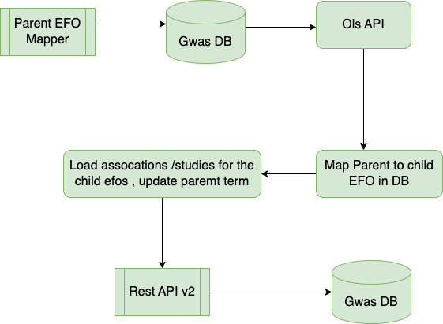

# gwas-association-parent-trait-mapper
This is a component which has been created in order to prepopulate parent traits for associations & studies in DB . This is done in order to
optimise Rest API v2 search for EFO terms with child traits. The exising Catalog Rest Api doesn't support this functionality & the Catalog UI has a non optimised approach
as below -:

* API maks a call to OLS API to retreive descendants for the parent EFO term.
* API validates whether the child traits returned are present in Gwas DB
* API makes a list of child traits which are present in Gwas DB & makes a call to Solr to serach for all EFO Traits.
* Sometimes the child traits returned are more than 1000 so it is not very optimised to make such query
* The response is slow & is very resource intensive.

As per of redesign need was felt to have prepopulated parent traits mapping for associations & studies so search can be extremely fast . 
The component accepts a list of EFO's which would be passed from the 'gwas-association-parent-trait-executor' as slurm batch job parameter
to execute in cluster. The process flow is as follows -:

* A new table created to map Parent to child Efo mapping.
* New tables create to map parent EFO's to association & studies.
* OLS API is called to retrieve the child terms for the parent EFO term & the child terms validated whether existing in Gwas.
* DB updated for parent child mapping
* Associations/Studies is queried for each of the child terms associated with parent term.
* Associations/Studies are updated with parent term using DB Parent child term mapping.
* The Rest APi will use this parent term to query association/Studies when queried for child terms.

The Job runs in 3 modes -:

-  **full** -> This mode passes efoId's as an array comma separated when cluster job run in full mode

-  **file** -> This mode passes efoId's as an array comma separated when cluster job run in file mode

- **largeefos** -> Normally for a parent EFO a single cluster job is enough to map the parent term form for all the chilefo's but in case
of parent term having more than 300 terms a single cluster job take too long & needs further partitioning to run in cluster mode , this is done
by creating a threadpool executor which executes cluster job to run the association mapper in 'childefos' mode. 

- **childefos** -> This mode runs to update parent term for childefo's Id's passes an array argument from the 'largeefos mode.

## Requirements

Before you begin, ensure you have met the following requirements:

- You have a MacOSX/Linux/Windows machine.
- You have Java 8 installed.

## Deploying this service locally
1. Install Java and JDK8
2. Clone the application from https://github.com/EBISPOT/gwas-data-services.git
3. Open the module gwas-association-parent-trait-executor.
3. Run `mvn clean install` to build the application and generate executable jar

## Running locally

1. Need to pass VM option -Dspring.datasource.username=***** -Dspring.datasource.password=****** -Dexecutor.thread-pool.count=10 -Dassociation.partition.size=15
2. Need to pass Program argument  -m <mode> -e <EFOID's comma sepaaretd>
3. Options for mode ['full','file','childefos','largeefos']
4. The options of 'childefos''largeefos' are for cluster only & not needed locally.

### Contributing

Submitting changes to the data follows this workfow:

1. Create a branch with using issue number and brief issue description using [kebab-case](https://medium.com/better-programming/string-case-styles-camel-pascal-snake-and-kebab-case-981407998841), eg. `git checkout -b 'goci-rest-71-rest-api-documentation'`
1. Do the work to fix the issue or add a new feature and commit message as appropriate
    - Summarize the change in less than 50 characters
    - Because: - Explain the reasons you made this change
    - Make a new bullet for each reason - Each line should be under 72 characters
    - Explain exactly what was done in this commit with more depth than the 50 character subject line. Remember to wrap at 72 characters!
1. Push local changes to the remote feature branch
1. Create a Pull Request to merge the updates in the feature branch into `develop` branch
1. Once the changes are merged into `develop` branch, the Gitlab plan will automatically deploy these changes to the Kubernetes sandbox environment where User Acceptance Testing can be done
1. When the UAT is completed successfully, the updates in `develop` can be merged into `master`, either through a Pull Request or using git merge from your local repo

### Contributors

- Check the contribution section [here](https://github.com/EBISPOT/gwas-rest-api/graphs/contributors)

### Troubleshooting

If something goes wrong, please check the logs.

